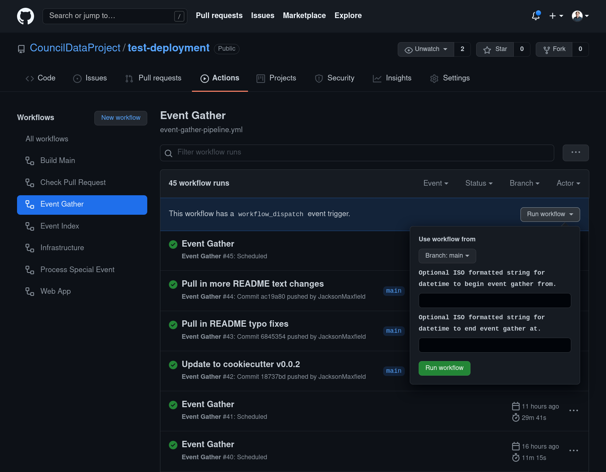

# Manually Triggering Event Gather

### Background

While event gather and processing is automated and runs on a schedule,
you may want to manually trigger the event gather and processing pipeline:

1. To backfill data into the infrastructure
    - I.e. to gather the weeks or months from before the instance
      was created.
2. To reprocess data
    - I.e. a prior automated run failed for some reason and you wish to rerun
      that time period.
    - I.e. new and more data in available from the scraper and as such updated and
      new data can enter into the CDP infrastructure.
3. To add a custom or special event
    - I.e. a press conference, debate, forum, etc.

## Backfilling and Reprocessing

To backfill or rerun the pipeline for a specific datetime range go to the
[Event Gather GitHub Action Page](https://github.com/triangleblogblog/cdp-ch/actions/workflows/event-gather-pipeline.yml).

Once there, you can add the begin and end datetimes as parameters to the workflow run.



See the Python
[`datetime.fromisoformat` documentation](https://docs.python.org/3/library/datetime.html#datetime.datetime.fromisoformat)
for examples of the allowed string patterns for these two parameters.

**Note:** If you chose a datetime range that results in many of events, the pipeline may
error as the pipeline can only run for six hours for one job. So if you wish to
backfill many months of data, consider breaking up the whole time period into
small enough datetime ranges that no single pipeline run lasts longer than six hours.

## Adding Custom Events

To add custom or special events to the CDP infrastructure go to the
[Process Special Event GitHub Action Page](https://github.com/triangleblogblog/cdp-ch/actions/workflows/process-special-event.yml).

Once there, you can add the full event details as a parameter to the workflow run.


The safest method to construct the event JSON string is using the
`cdp-backend` Python API:

1. `pip install cdp-backend`
2. Create a Python file with your Event definition, at the end,
   print the JSON string of the event
   (including the wrapping `'` characters -- `repr` does this for you).

```python
from datetime import datetime

from cdp_backend.pipeline import ingestion_models

# Define your event
event = ingestion_models.EventIngestionModel(
    body=ingestion_models.Body(name="2021 Mayoral Debates"),
    sessions=[
        ingestion_models.Session(
            video_uri="https://video.seattle.gov/media/council/brief_091321_2012171V.mp4",
            session_datetime=datetime(2021, 9, 13),
            session_index=0,
        ),
    ],
)

# Print out the JSON string in it's full form
print(repr(event.to_json()))
```

3. Run your file

```bash
python your-file.py
```

4. Run the workflow

    Copy and past the output from your terminal into the "Run workflow" parameter and
    then click the "Run workflow" button itself. If the data provided is valid and
    publically available (i.e. videos are publically downloadable), the pipeline will
    run and your custom event will make it's way into CDP infrastructure.
